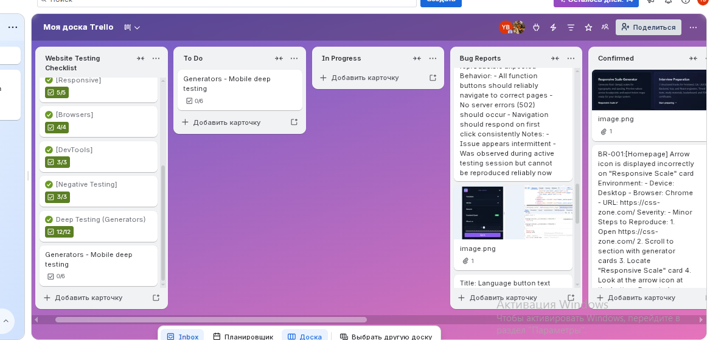

#  CSS & UI Generators Testing Project

##  Project Overview
Testing audit of a public web application ([css-zone.com](https://css-zone.com/)) providing interactive CSS and UI generators. 

The goal was to evaluate functional integrity, responsive layout behavior across viewports, boundary handling, and backend stability under simulated real-world usage.

---

##  Testing Scope & Strategy

* **Exploratory & Ad-Hoc Testing:** Simulating realistic user navigation flows across tools.
* **UI/UX & Responsive Testing:** Verification on desktop viewports and mobile layouts (iOS/Safari & Android/Chrome).
* **Boundary & Input Validation:** Testing extreme values (e.g., zero, negative, large string inputs).
* **DevTools Inspection:** Monitoring console errors, DOM container constraints, and network status codes (HTTP status monitoring).

---

##  Test Environment & Tools

* **Browsers:** Chrome (Desktop), Safari (iOS), Chrome (Android)
* **Tools:** Chrome DevTools, Trello (Task & Bug Lifecycle Tracking), Notion
* **Methodology:** Exploratory Testing, Boundary Value Analysis, Responsive Testing

---

##  Key Bugs Identified

| Bug ID | Summary | Component | Severity |
| :--- | :--- | :--- | :--- |
| **[BUG-01](./bug-reports/)** | Visual arrow icon misalignment inside generator cards | UI / Cards Layout | Low |
| **[BUG-02](./bug-reports/)** | Intermittent HTTP 502 Bad Gateway error during generator navigation | Navigation / Backend | High |
| **[BUG-03](./bug-reports/)** | Language selector button text overflows boundaries on mobile viewports | Header / Localization | Medium |

> Detailed steps, expected vs. actual outcomes, and environment details are available in the [`/bug-reports`](./bug-reports/) folder.

---

##  Testing Artifacts & Workflow Evidence

This project follows a structured engineering workflow documented through dedicated artifacts:

*  **[Checklists](./checklists/):** Operational verification lists for DevTools, UI, Generators, Navigation, and Responsive design.
*  **[Test Cases](./test-cases/):** End-to-end test scenarios covering sanity, dynamic generation, mobile usability, and cross-browser support.
*  **[Visual Evidence](./evidence/):** Screenshots of Trello task management, DevTools DOM inspection, and annotated bug proofs.

### Workflow Example (Trello Management):

---

##  Key Findings & Conclusion
* Core generator calculation logic and CSS code output remain stable under normal usage.
* Identified edge cases primarily affect mobile container constraints and server responses during rapid navigation switches.
* Overall user experience is functional, with clear opportunities for UI alignment and localization handling improvements.

---

**Author:** QA Engineer | Web, Functional & Exploratory Testing
